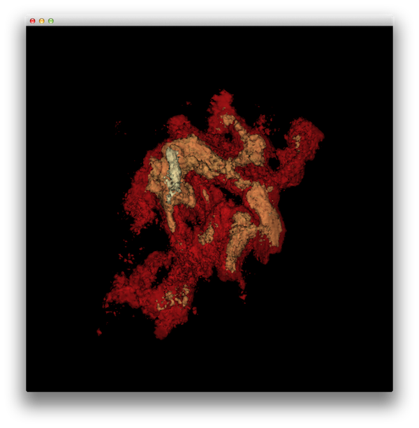

About
=====

Experiments with VTK and iso-contour drawing. You can create a conda environment to try this out in using:

```
conda create -n vtk-viewer-test python=2.7 --yes
source activate vtk-viewer-test
conda install pyqt vtk numpy astropy pip --yes
pip install spectral_cube palettable
```

To run:

```
python vtk_renderer.py filename [levels] [--stretch-spectral=value]
```

e.g.

```
python vtk_renderer.py ../L1448_13CO.fits 1 2 3 4 5 --stretch-spectral=2.
```


